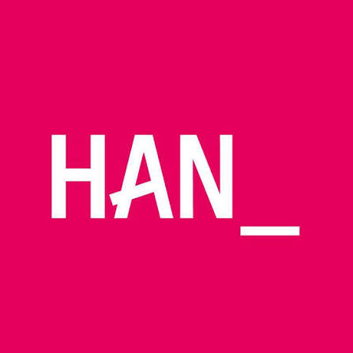

# Onderzoeksplan

### Wervingsaanpak Data & AI

**Auteurs:** Jae Dreijling, Bart Ressing, Maryam Yousufzai, Karlijn van der Meer

**Status:** concept! (er is nog geen idee/technologie gekozen.) De structuur en onderzoeksmethodiek hieronder staan al klaar; de velden gemarkeerd met [ in te vullen ] worden aangevuld zodra er een richting is.

---

## Versiebeheer

| Versie | Datum | Status | Auteur | Omschrijving |
|---|---|---|---|---|
| 0.1 | 13-9-2026 | Concept | Jae Dreijling | Opzet document: structuur |
| 0.2 | 14-9-2026 | Concept | Jae Dreijling | Basisinformatie uit casus |
| 0.3 | 15-9-2026 | Concept | Bart Ressing, Jae Dreijling, Karlijn van der Meer, Maryam Yousufzai | Opdrachtgever informatie toegevoegd, deelvragen opgesteld, titelpagina verbeterd, onderzoeksvraag geoptimaliseerd. |

> **Notitie voor dinsdag:** Het document is opgezet op basis van de criteria & de voorbeelden die we hebben! De informatie die er staat is alleen de informatie direct van de casus/lesmateriaal, dus er is niks ingevuld/ingezet dat niet besproken is. (Behalve 1 begrippenlijst; omdat ik de term moest googlen), suggesties voor deelvragen kunnen in comments gezet worden om te bespreken.

## Begrippenlijst

*(Opmerking in document: sowieso ook afkortingenlijst toevoegen, apart ding)*

Hier definiëren we de begrippen die we nodig hebben om onze keuzes te kunnen onderbouwen. Dit overzicht groeit nog: pas zodra we met een idee aan de slag gaan, weten we welke begrippen we verder nodig hebben. In deze begrippenlijst nemen we ook afkortingen op om het document beknopt te houden.

| Begrip | Definitie | Bron |
|---|---|---|
| **Doelgroepsegmentatie** | Een doelgroep opdelen op basis van bijvoorbeeld leeftijd, interesses of gedrag, zodat je een oplossing kunt maken die daar echt bij past. | Uit DTI_Requirements & userstories |
| | | |

(Dit vullen we verder aan als we onderzoeksvragen beantwoorden. Elk begrip dat we gebruiken om een keuze te onderbouwen, hoort hier te staan mét bron, als het niet een heel bekend woord is.)

## Doelstellingen en doelgroepen

### Aanleiding

Binnen de ICT-opleiding kiezen relatief weinig studenten voor de richting Data & AI. Dat is opvallend, want die richting wordt juist steeds belangrijker, zowel qua maatschappelijke impact als qua kans op werk. Daarmee laten zowel studenten als de opleiding hier kansen liggen.

> **Opmerking in document:** Hier zitten aannames in: dit is iets om te onderzoeken, niet objectief.

Op dit moment wordt er geworven op vier momenten: schoolvoorlichting, open dag, proefstuderen en het keuzemoment in de propedeuse. Dat is gericht op vier doelgroepen: MBO'ers, HAVO/VWO'ers, propedeusestudenten, en mensen met een baan die daarnaast een studie willen volgen.

Het probleem: de manier waarop dat nu gebeurt is vooral traditioneel (denk aan folders, een praatje, een standje) en dat sorteert onvoldoende effect. (Bron: casusbeschrijving Lesmateriaal/AI-en-DATA, later in de sources zetten)

### Opdrachtgever

De opdrachtgevers van deze casus zijn Jorg Janssen en Sjarl Kuijltjes.

Wat we uit de casusbeschrijving al wél weten over de verwachtingen van de opdrachtgever:

- Zij willen meer/betere instroom in de richting Data & AI.
- Ze verwachten een concrete, technologisch geavanceerde aanpak, geen puur adviesrapport, maar iets testbaars/demonstreerbaars.
- De huidige (traditionele) middelen voldoen niet meer; er is dus ruimte (en wens) voor een andere aanpak dan "nog een folder".

Volgens het rooster (bronverwijzing) zijn er 4 gefaciliteerde opdrachtgeverontmoetingen gedurende de minor; daarbuiten moeten we zelf assertief contact zoeken.

### Kansen

Met technologie en AI kun je werving persoonlijker, interactiever en beter meetbaar maken dan met de traditionele aanpak. Denk aan een middel dat inzicht geeft in wat een potentiële student interessant vindt, of een laagdrempelige manier om te laten zien wat Data & AI precies inhoudt, zonder dat het meteen droog of ingewikkeld overkomt.

### Doelstelling

[in te vullen zodra we een idee/concept hebben gekozen, bijvoorbeeld: "Met dit onderzoek willen we een [type oplossing] ontwikkelen waarmee scholieren en propedeusestudenten op een aansprekende manier kunnen ontdekken of Data & AI bij ze past."]

(te vroeg)

### Doelgroep (tot nu toe)

| Doelgroep | Contactmoment(en) | Kenmerken/aandachtspunten |
|---|---|---|
| **MBO-scholieren** | Schoolvoorlichting, open dag | [in te vullen] |
| **HAVO/VWO-scholieren** | Schoolvoorlichting, open dag, proefstuderen | [in te vullen] |
| **Propedeusestudenten** | Keuzemoment in de propedeuse | [in te vullen] |
| **Mensen met een baan die daarnaast een studie willen volgen** | Schoolvoorlichting, open avond, proefstuderen | [in te vullen] |

### Opdracht

Ontwerp, ontwikkel en test een innovatieve, technologisch geavanceerde wervingsaanpak voor Data & AI die aansluit bij de contactmomenten en de verschillende doelgroepen. (Letterlijk overgenomen uit de casusbeschrijving)

## Theoretische kader

(Zie [Begrippenlijst](#begrippenlijst) voor losse definities om snel op te zoeken)

Waar we nu al aan denken om verder uit te werken zodra relevant:

- Doelgroepsegmentatie (geografisch/demografisch/psychografisch/gedrag): sluit aan bij de indeling MBO/HAVO-VWO/propedeuse, zie Lesmateriaal/DTI_Requirements & userstories.pdf.
- Requirements (SMART) & userstories (ITVES): om straks concrete eisen aan onze oplossing te kunnen stellen.
- Etc. Etc. Theorie specifiek voor het gekozen idee

## Onderzoeksvragen

### Hoofdvraag

**Let op: dit is nog een conceptversie**, we passen 'm aan zodra we een idee hebben gekozen:

*"Hoe kan een technologisch-innovatieve wervingsaanpak scholieren (MBO/HAVO/VWO) en propedeusestudenten helpen ontdekken of de richting Data & AI bij hen past, aansluitend bij de contactmomenten schoolvoorlichting, open dag, proefstuderen en het keuzemoment in de propedeuse?"*

**Waarom deze vraag:** Relatief weinig studenten kiezen nu voor Data & AI, terwijl de richting juist aan belang wint. Dat laat zien dat het probleem niet bij het bestaansrecht van de richting ligt, maar bij hoe die op dit moment onder de aandacht wordt gebracht. Door de vraag te koppelen aan de vier bestaande contactmomenten en de drie concrete doelgroepen blijft hij simpel, en vormt hij de basis om straks een concept te ontwerpen én te testen.

### Deelvragen

We hebben dit opgebouwd volgens het kader dat de docent gaf: welke vragen volgen er logisch uit onze ideeën, wat moeten we nog weten over de doelgroep (en hoe komen we daarachter), en wat hebben we nodig om elk van de top-3 ideeën ook echt te kunnen bouwen. Elke deelvraag is verder opgesplitst in sub-deelvragen om de methodiek scherper te maken.

| # | Deelvraag | Relevantie | Type | Onderzoeksstrategie | Onderzoeksmethode | Waarom | Bron |
|---|---|---|---|---|---|---|---|
| **Blok A: Wat weten we over de doelgroep** | | | | | | | |
| **Blok B: Ideeën verkennen** | | | | | | | |
| **Blok C: Kan het ook echt gebouwd worden** | | | | | | | |

*Opmerking in document bij de Bron-kolom van de tabelkop: belangrijke blokken, Ethiek (aangezien het jongeren zijn, hoge prio), Welke doelgroep willen we (eerste blok).*

De Deelvraag-kolom van bovenstaande tabel staat nog leeg; onderstaande voorstellen staan als reviewer-comments bij de betreffende rijen en zijn nog niet in de tabel zelf verwerkt.

**Bij Blok A:**

- **Deelvraag 1A:** Wat weten en denken [doelgroep] op dit moment over de richting Data & AI? Relevantie: dit bepaalt ons startpunt, kunnen we voortbouwen op wat ze al weten, of moeten we eerst uitleggen wat Data & AI eigenlijk is? Type: beschrijvend. Onderzoeksstrategie: Field. Onderzoeksmethode: Enquête + interview (op school/tijdens open dag). Bron: DTI_Requirements & userstories.pdf
- **Deelvraag 2A:** Welke informatiebehoefte heeft [doelgroep] per contactmoment (inspireren/informeren/activeren/committeren)? Relevantie: elk contactmoment vraagt om een andere aanpak, een open dag draait om inspireren, het keuzemoment in de propedeuse juist om activeren. Type: beschrijvend. Onderzoeksstrategie: Field. Onderzoeksmethode: Contextmapping / korte interviews tijdens bestaande contactmomenten. Waarom: zo voorkomen we dat we één generieke oplossing bedenken voor vier heel verschillende situaties. Bron: DTI_Requirements & userstories

**Bij Blok B:**

- **Deelvraag B1:** Welke concepten (top 3) zijn kansrijk om de wervingsopdracht mee in te vullen, gegeven wat we uit Blok A hebben geleerd? Relevantie: vertaalt wat we over de doelgroep weten naar concrete richtingen, vóórdat we ergens definitief voor kiezen. Type: ontwerpend. Onderzoeksstrategie: Library / Workshop. Onderzoeksmethode: brainstorm (bijvoorbeeld crazy eights), deskresearch naar bestaande wervingscampagnes elders, expert interview (docent/opdrachtgever). Waarom: we willen systematisch ideeën genereren in plaats van meteen op onze eerste ingeving af te gaan, dit past bij de build-to-design-aanpak van de minor. Bron: Kickoff_DTI_2627S1.pdf

**Bij Blok C:**

- **Deelvraag C1:** Wat hebben we nodig (technisch, inhoudelijk, tijd/tools) om elk van de top-3 ideeën echt te realiseren? Relevantie: zo voorkomen we dat we een idee kiezen dat helemaal niet haalbaar blijkt binnen de sprints of tools van de minor. Type: evaluerend. Onderzoeksstrategie: Library / Field. Onderzoeksmethode: technische deskresearch, quickscan-prototyping, expert interview (gekoppeld aan de Fablab-tools: Blender, Unity, Vibe-Coding, Arduino, zie week 41). Waarom: we willen een onderbouwde keuze maken in plaats van te kiezen op onderbuikgevoel, en meteen checken of het past bij wat er binnen de minor beschikbaar is. Bron: de Deliverables

*Discussie in comments bij de titel van Blok C:*

> Denk niet dat deze blokken nodig zijn, ze maken de rest van de tabel kleiner en geven niet extra bruikbaar inzicht, wij kunnen de deelvragen zelf ook verdelen en organiseren zonder deze blokken.
>
> **Reactie:** Ik snap dat, ik had dat gedaan omdat de beoordeling een verschil wil zien, maar misschien is het visueel wat meer clutter. Misschien kan het gewoon een kolom zijn in plaats van een row. Ik vind dat het wel belangrijk is om ze te benoemen omdat het de rubric-eis wat duidelijker apart maakt, ook makkelijker te verwijzen en presenteren zo.

#### Mogelijke deelvragen

*(Opmerking in document bij deze kop: "Motifaction"-onderzoek (motivation + faction?) van docent)*

**Samenwerkingsgrenzen en voorwaarden:**

- Reactietijd? (2-3 werkdagen)
- Zijn wij verantwoordelijk voor testsubjecten? Of worden deze aan ons voorgesteld?
- Communicatie per mail/teams/fysiek?
- Er wordt voor de gesprekken een agenda opgestuurd en na het gesprek worden de notulen behouden.
- Wat missen wij? Zijn er nog resources die wij bij jullie kunnen opvragen? (Anders dan al de aangevraagde resources)
- Hoe zit het met de budgettering?
- Hoeveel materialen van school kunnen wij gebruiken? (Bijvoorbeeld, spoorweg idee).
- Gratis koffie verleend (pas)?
- Zijn er mogelijkheden buiten de 4 standaard contactmomenten met de nieuwe studenten en zijn deze contactmomenten even kansrijk?
- Is het belangrijk in welke taal we deze opdracht uitvoeren? Aangezien er ook nationale studenten op de HAN aanwezig zijn.
- Wat doen andere opleidingen om studenten te lokken.

**Belangrijke aannames neerzetten**, en samen met de opdrachtgever bekijken welke het belangrijkst zijn om te onderzoeken.

Aannames:

1. 'Want wat mensen denken is dat veel werk wordt weggenomen en geen Data & AI mensenbanen over zullen zijn'.
2. Dat mensen gewoon niet willen beginnen aan Data & AI of dat mensen eigenlijk het onduidelijk vinden wat Data & AI doet, hoever je ermee komt en wie je kan worden.
3. 

**Doelgroep vragen:**

- Welke doelgroep wordt op gefocust? Hoe gaat dit onze aanpak en uitwerking aanpassen?
- Gaan wij focussen op mensen van het gehele ICT of alleen op Data en AI studenten?
- Vinden jullie alleen inschrijven belangrijk, maar ook het behouden van deze studenten?
- Hebben jullie een leeftijdsgroep die jullie meer willen bereiken dan de ander? Als er een idee opkomt dat meer een jonger leeftijd groep betrekt, dan de ander. Of willen jullie alle leeftijdsgroepen kunnen bereiken met één idee?

**Eerdere resultaten vragen:**

- Wat is er al geprobeerd door de docenten? En in hoeverre is het wel/niet gelukt?
- Hoe verschilt het huidige jaar met voorgaande jaren door middel van het nieuwe propedeuse jaar opzet?
- Hebben wij nog grote problemen in de reden waarom mensen niet naar Data en AI gaan?
- Wat is de huidige status?
- Hoe urgent is dit vraagstuk voor jullie, wat staat er voor de opleiding op het spel?

**Voorwaarden vragen:**

- Wat is het budget?
- Vanaf welk aantal is het goed genoeg?
- Hoe gaan we de doelgroep bereiken?

**Inhoudelijke Data & AI opleiding vragen:**

- Hoe verschilt de inhoud van de huidige opleiding met de oude opleiding (Data & AI - DSD)?
- Hoe is het DSD-profiel veranderd naar Data & AI en waarom is BIM helemaal verwijderd, wanneer er wel een groter instroom was.

*(kleur: groen, in het origineel)*

- Hoe moeten wij omgaan met de doelgroep? Wordt data verwerken? Hoe wordt dit opgeslagen? (Ethiek)
- Gaan wij meerdere dingen proberen, of 1 ding helemaal uitwerken?
- In hoeverre willen we Data & AI onderscheiden van andere ICT-opleidingen?
- Moeten wij ook kijken naar uitval, of alleen instroom belangrijk?
- Hoe verwerken we feedback in het proces en product?
- Van wie willen we feedback hebben?
- Hoe vaak willen we feedback hebben?
- Hoe gaan we om als het idee toch niet werkt?
- Welk idee willen we gaan voorleggen bij de opdrachtgever?
- Hoe gaan we het documenteren?
- Wanneer is een prototype goed genoeg?

*(kleur: blauw, in het origineel)*

- Kunnen wij VR gebruiken om onze uitwerking nog beter te laten presteren op het gebied van mensen trekken?
- Hoe gaan wij onze applicatie testen? Gaan wij dit op een open dag doen? Gaan wij HAN studenten vragen? Gaan wij bij een middelbare school vragen voor een mening?
- Hoe maken we het reproduceerbaar?
- Hoe maken wij dit veilig, zodat belangrijke dingen niet misgaan op de open dagen etc?

#### Sub-deelvragen per deelvraag

- **A1**
  - Deelvraag
  - deelvraag
- **A2**
  - Deelvraag
- **A3**
- **B1**
- **B2**
- **Etc.**

#### Haalbaarheid per idee

*(dit vullen we in zodra onze top-3 bekend is, nu nog te vroeg)*

| Idee | Wat is nodig (technisch) | Wat is nodig (inhoudelijk/kennis) | Geschatte tijd/complexiteit | Past bij beschikbare tools? |
|---|---|---|---|---|
| | | | | |

*(Opmerking in document: dit nog niet invullen, later pas.)*

## Planning

De precieze data, deadlines en mijlpalen voor dit onderzoek volgen het minor-rooster. De twee belangrijkste momenten voor dit plan:

- Feedbacksessie/go-no-go conceptpresentatie: week 38
- Definitieve versie van dit onderzoeksplan inleveren: stakeholderbijeenkomst 1, week 40

We werken hierbij volgens de agile/iteratieve aanpak van de minor: korte design sprints, met feedbacksessies om de ~2 weken en stakeholderbijeenkomsten als omslagpunt tussen sprints.

(Verder dinsdag uitwerken)

*(Opmerking in document: tabel maken)*

## Literatuurlijst

(In APA-formaat zoals school het vraagt!)

[Auteur. (Jaar). Titel. URL/uitgever.]

Gebruik: https://www.scribbr.nl/bronvermelding/generator/apa/
