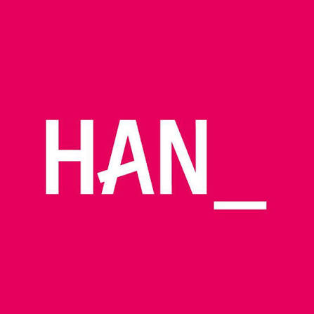

# Onderzoeksplan

### Wervingsaanpak Data & AI

**Auteurs:** Jae Dreijling, Bart Ressing, Maryam Yousufzai, Karlijn van der meer

**Status:** Concept! (Er is nog geen idee/technolgie gekozen.) structuur en onderzoeksmethodiek staan al klaar, velden gemarkeerd met [in te vullen] volgen zodra er een richting is.

---

## Versie beheer

Op dit moment houden we hierbij wie wanneer een wijziging aanbrengt. Zodra het onderzoeksplan af is, wordt dit versie 1.0 en krijgen alleen grotere updates nog een nieuw versienummer. Tot die tijd gebruiken we dit overzicht om het werk aan het onderzoeksplan bij te houden.

| Versie | Datum | Status | Auteur | Omschrijving |
|---|---|---|---|---|
| 0.1 | 13-9-2026 | Geaccepteerd | Jae Dreijling | Opzet document: structuur |
| 0.2 | 14-9-2026 | Geaccepteerd | Jae Dreijling | Basisinformatie uit casus ingevoerd |
| 0.3 | 15-9-2026 | Geaccepteerd | Bart Ressing, Jae Dreijling, Karlijn van der meer, Maryam Yousufzai | Opdrachtgever informatie toegevoegd, deelvragen opgesteld, titelpagina verbeterd, onderzoeksvraag geoptimaliseert. |
| 0.4 | 24-9-2026 | Geaccepteerd | Jae Dreijling | Opdrachtgeversgesprek verwerkt: positionering + doelgroepanalyse aangevult, drie concepten + feedback opdrachtgever erbij, praktische randvoorwaarden en actiepunten vastgelegd |
| 0.5 | 25-9-2026 | Concept | Bart Ressing | onderzoeksplan doorgenomen opmerkingen plaatsen, aanvullen en veranderen |

### Scope van dit document

Dit is het onderzoeksplan; vragen, methodes, begrippen, theoretisch kader, risico's, planning op hoofdlijnen, versiebeheer. Actiepunten met eigenaar/deadline, losse feedback-reacties en ruwe brainstormlijsten horen hier niet in (die horen in het verslag/de notulen, resp. de feedbacklog).

## Begrippenlijst

> 💬 **Bart Ressing:** Sowieso ook afkortinglijst toevoegen (apart ding)

Begrippen die we nodig hebben om onze keuzes te onderbouwen. Groeit nog: zodra we met een idee aan de slag gaan weten we pas welke begrippen erbij moeten. Afkortingen zetten we er ook in, scheelt weer een aparte lijst.

| Begrip | Definitie | Bron |
|---|---|---|
| **Doelgroepsegmentatie** | Een doelgroep opdelen op basis van bijvoorbeeld leeftijd, interesses of gedrag, zodat je een oplossing kunt maken die daar echt bij past. | Uit DTI_Requirements & userstories |
| | | |

Deze tabel vullen we verder aan zodra we onderzoeksvragen beantwoorden; elk begrip dat we gebruiken om een keuze te onderbouwen hoort hier met bron, tenzij het een heel bekend woord is ofc

## Doelstellingen en doelgroepen

### Aanleiding

Binnen de ICT-opleiding kiezen relatief weinig studenten voor Data & AI. opvallend, want de richting wordt juist steeds belangrijker (zowel qua maatschappelijke impact als qua kans op werk). dus: studenten en de opleiding laten hier kansen liggen.

nu worden er studenten geworven op vier momenten: schoolvoorlichting, open dagen, proefstuderen, keuzemoment in de propedeuze. gericht op vier doelgroepen: MBo'ers, HAVO/VWO'ers, propedeusestudenten, en mensen met een baan die daarnaast willen studeren.

> 💬 **Bart Ressing:** Dit mag gramaticaal anders, het leest namelijk niet lekker. Ben zelf ook aan het nadenken over een oplossing voor deze zin.
>
> **Jae Dreijling:** Misschien its zoals "Op dit moment worden studenten op vier momenten geworven: tijdens schoolvoorlichtingen, open dagen, proefstudeerdagen en het keuzemoment in de propedeuse. De werving richt zich op vier doelgroepen: mbo'ers, havo/vwo-leerlingen, propedeusestudenten en werkenden die naast hun baan willen studeren." gewoon het apart zetten naar 2 zinnen i.p.v. een langere. (als dit goed past)
>
> **Bart Ressing:** dit klinkt inderdaad al veel beter. denk dat dit dus goed is

het probleem: de aanpak nu is vooral tradtioneel (folder, praatje, standje), sorteert onvoldoende effect. (bron: casusbeschrijving Lesmateriaal/AI-en-DATA, later in de sources zetten)

### Opdrachtgever

opdrachtgevers van deze casus: Jorg Janssen en Sjarl Kuijltjes. Zij zijn docenten binnen de HAN voor de opleiding ICT.

wat we al wél weten over hun verwachtingen (uit de casusbeschrijving):

- willen meer/betere instroom in Data & AI
- verwachten een concrete, technologisch geavanceerde aanpak: geen puur adviesrapport, iets testbaars/demonstreerbaars (HARD REQUIREMENT)
- huidige (traditionele) middelen voldoen niet meer, dus ruimte (en wens) voor iets anders dan "nog een folder

Volgens het rooster van de minor, zie bijlage [nummer], zijn er 4 gefaciliteerde meetings met de opdrachtgever. Daarbuiten zullen wij, het projectteam, en de opdrachtgevers dus zelf contact moeten zoeken.

aanvulling na opdrachtgeversgesprek 23-9-2026 (zie (link naar notulen))):

- officiële accreditatienaam is HBO-ICT; Data & AI is hierbinnen een uitstroomrichting, geen eigen opleiding (goed om te onthouden voor hoe we het framen!)
- docententeam Data & AI is klein: ongeveer 4 tot 10 docenten, die zowel onderwijs ontwikkelen als lesgeven als open dagen draaien; dus concepten moeten zelfstandig te gebruiken en makkelijk op te zetten zijn door studenten/docenten (HARD REQUIREMENT)

  > 💬 **Bart Ressing** (bij "HARD REQUIREMENT"): Zou hier neerzetten dat de opdrachtgever dit heel graag acht. Maar dat voor ons wel belangrijk is dat wij, Hoeven we niet op te schrijven, een voorkeur moeten geven aan de minor dus als dat niet past bij onze oplossing wij daar niet voor Hoeven te stoppen.Maar weet niet hoe jullie allen daar in zitten?>
  >
  > **Jae Dreijling:** Ik denk dat het goed is om dit te bespreken tijdens de les; bijvoorbeeld vragen of als wij weten dat iets echt belangrijk is voor hun om het uit te voeren, mogen wij iets wat hun as een requirement zien, ook laten vallen als het mogelijk tegen de minor verlangen gaat?Ik sta er zelf in dat dit wel een hard requirement is, aangezien als hun het niet goed kunnen verzorgen in hun kleine team, werken wij niet meer voor hun voor de minor, maar werken wij voor de minor met hun als nagedachte.

- communicatie: korte vragen via teams-chatgroep, inhoudelijke feedback tijdens geplande overleggen
- resources & budget: HAN-materialen (zoals raspberry pi's) op aanvraag; voor concrete/zinnige ideeën kan budget geregeld worden
- concepten testen kan tijdens ingeplande schoolvoorlichtingen (excel-lijst op teams) of bij eerstejaarsgroepen

### Kansen

met technologie en AI kun je werving persoonlijker, interactiever en beter meetbaar maken dan de traditionele aanpak. denk aan iets dat inzicht geeft in wat een potentiële student interessant vindt, of een laagdrempelige manier om te laten zien wat Data & AI precies inhoud (zonder dat het meteen droog of ingewikkeld overkomt).

### Doelstelling

[in te vullen zodra we een idee/concept hebben gekozen, bijvoorbeeld: "Met dit onderzoek willen we een [type oplossing] ontwikkelen waarmee scholieren en propedeusestudenten op een aansprekende manier kunnen ontdekken of Data & AI bij ze past."]

(te vroeg)

### Doelgroep (tot nu toe)

| Doelgroep | Contactmoment(en) | Kenmerken/aandachtspunten |
|---|---|---|
| **MBO-scholieren** | Schoolvoorlichting, open dag | komen volgens de opdrachtgevers vaak binnen vanuit infra/cybersecurity of software development (dus al wat ICT-achtergrond) |
| **HAVO-scholieren** | Schoolvoorlichting, open dag, proefstuderen | Komen vaak 'blanco' binnen volgens de opdrachtgeverss, geen ICT-achtergrond op mbo-niveau; soms al vastomlijnd beeld of kiezen sneler voor bekendere richtingen |
| **VWO-Scholieren** | schoolvoorlichting, open dag, proefstuderen | kiezen op uni-niveau wel massaal voor AI (bv. radboud universiteit nijmegen, decentrale selectie/numerus fixus) maar stromen bijna niet door naar het HBO |
| **Propedeusestudenten** | Keuzemoment in de propedeuse | [in te vullen] |
| **Mensen met een baan die daarnaast een studie willen volgen** | Schoolvoorlichting, open avond, proefstuderen. | [in te vullen] |

algemene beeldvorming/misvattingen/aannames (hele doelgroep), uit het gesprek van 23-9

- scholieren hebben vaak geen helder beeld van wat Data & AI inhoud of welke beroepen erbij horen
- AI = vaak versmald tot LLM's, of angst dat AI banen overneemt
- data voelt "onzichtbaar" ,terwijl studenten juist tastbare resultaten willen laten zien (zoals bij game/software development)
- vraag vanuit bedrijfsleven naar dataspecialisten is groot, alleen IT-managers/bedrijven verwoorden dit niet altijd expliciet op stagemarkten

#### Contactmomenten

uit het opdrachtgeversgesprek 23-9 (zie Notulen 23-09-2026): opdrachtgever benadrukt vier specifieke contactmomenten.

- schoolvoorlichtingen: gastlessen/workshops op middelbare scholen en mbo's; 30 min tot 2,5 uur
- open dagen: presentatiewand/-tafels, de eerstvolgende zijn: nijmegen (7 november) en arnhem (14 november); "iets te zien" (showcase op scherm) + "iets te doen" (workshop ~15 min)
- proefstuderen: inhoudelijke activiteit, ~1u15, moet realistisch aansluiten bij echte lessen
- keuzemoment eerstejaars: al ingestroomde eerstejaars (propedeuse) overtuigen om eind eerste jaar definitief voor Data & AI te kiezen. Bij dit moment Hoeven wij niks te doen, aangezien het aan de docenten is zodra de studenten gestart zijn. Dit kwam uit het gesprek met de opdrachtgevers.

### Opdracht

Ontwerp, ontwikkel en test een innovatieve, technologisch geavanceerde wervingsaanpak voor Data & AI die aansluit bij de contactmomenten en de verschillende doelgroepen. (Letterlijk overgenomen uit de casusbeschrijving)

## Concepten

Nadat wij de opdracht kregen hebben wij ideeën zitten bedenken. Hierbij kregen wij veel ideeën ruwweg op papier en hebben wij drie hoofdconcepten voorgelegd aan de opdrachtgever, gesellecteerd uit 48 ideeën. Onze ideeën kwamen vooral Voort uit de uitvalshoek van de toekomstige student, dus wat zouden hun aantrekken.

### Concept 1: fysieke/virtuele trein (showcase & cross-over)

Trein die data verzamelt, AI past de spoorroute aan, data zichtbaar op dashboard/app.User interactie zit in het feit dat de toekomstige student het treinspoor kan aanpassen en beïnvloeden. Waarbij de AI de nieuwe route ziet en gebruikt.

**Feedback opdrachtgever:** zeer sterk, brengt alle ICT-richtingen samen (software/infra/data); voor open dagen wel afstemmen met bestaande opstellingen (zoals 'hekje gek' van infra); goed voor schoolvoorlichtingen of als unity/vr-simulatie.

### Concept 2: AI-huisdier/ decision tree builder (interactieve workshop)

Workshop: scholieren bouwen op verschillende niveaus een eigen AI-pet via bijvoorbeeld het maken van een decision tree, met hulp van een virtuele keeper (AI-assistant); eventueel gekoppeld aan 3D-geprinte figuurtjes met nfc-chips of een mee te nemen bestand.

**Feedback opdrachtgever:** erg geschikt voor workships op scholen/open dagen; thema's varieren belangrijk (fiets, vliegtuig, robot, etc.) voor brede doelgroep (incl. meiden), niet alleen "nerds". Kosten en fysieke haalbaarheid goed bewaken.

### Concept 3: biometrische data poster / live dashboard (showcase)

Scholieren scannen hun vinger, zien live hun biometrische data (hartslag, zuurstof) op scherm, gekoppeld aan maatschappelijke toepassingen (zorg, milieu).

**Feedback opdrachtgever:** goed als snelle showcase/kijkdingetje op open dag; moet wel altijd een zelfmaak-element hebben, anders voelt het niet alsof studenten zelf iets gebouwd hebben.

Verder uitwerken in de Haalbaarheid per idee-tabel (link) zodra technisch/inhoudelijk is uitgezocht per concept, zie Actiepunten (link)

## Theoretische Kader

(Zie [Begrippenlijst](#begrippenlijst) voor losse definities om snel op te zoeken)

Waar we nu al aan denken om verder uit te werken zodra relevant:

- Doelgroepsegmentatie (geografisch/demografisch/psychografisch/gedrag): sluit aan bij de indeling MBO/HAVO-VWO/propedeuse, zie Lesmateriaal/DTI_Requirements & userstories.pdf.
- Requirements (SMART) & userstories (ITVES): om straks concrete eisen aan onze oplossing te kunnen stellen.

  > 💬 **Bart Ressing** (bij "ITVES"): Wat betekend deze afkorting?
  >
  > **Jae Dreijling:** Het is een foute spelling van INVEST.. oops

- Etc. Etc. Theorie specifiek voor het gekozen idee

## Onderzoeksvragen

### Hoofdvraag

let op: nog een conceptversie, passen 'm aan zodra we een idee hebben gekozen

*"Hoe kan een technologisch-innovatieve wervingsaanpak scholieren (MBO/HAVO/VWO) en propedeusestudenten helpen ontdekken of de richting Data & AI bij hen past,*

**Waarom deze vraag:** relatief weinig studenten kiezen nu voor Data & AI, terwijl de richting juist aan belang wint; probleem zit dus niet bij het bestaansrecht van de richting, maar bij hoe die nu onder de aandacht wordt gebracht. door 'm te koppelen aan de vier bestaande contactmomenten en de doelgroepen blijft hij simpel, en is hij de basis om straks een concept te ontwerpen én te testen.

### Deelvragen

opgebouwd volgens het kader van de docent: welke vragen volgen logisch uit onze ideeën, wat moeten we nog weten over de doelgroep (en hoe komen we daarachter), en wat hebben we nodig om elk van de top-3 ideeën ook echt te bouwen. elke deelvraag verder opgesplitst in sub-deelvragen om de methodiek scherper te maken.

status = concept (nog niet afgestemd) of goedgekeurd (bevestigd door docent/opdrachtgever). nu staat alles nog op concept, niks is al formeel afgetikt.

#### blok A: wat weten we over de doelgroep

| **deelvraag 1A (concept):** | "wat weten en denken [doelgroep] op dit moment over de richting Data & AI?" |
|---|---|
| type deelvraag | beschrijvend |
| doel van de vraag | bepaalt ons startpunt, kunnen we voortbouwen op wat ze al weten of moeten we eerst uitleggen wat Data & AI is? |
| **onderzoek:** | |
| onderzoeksstrategie | field |
| onderzoeksmethode | enquete + interview (op school/tijdens open dag) |
| bron | DTI_Requirements & userstories.pdf |
| **deelvraag 2A (concept):** | "Welke informatiebehoefte heeft [doelgroep] per contactmoment (inspireren/informeren/activeren/committeren)?" |
| type deelvraag | beschrijvend |
| doel van de vraag | elk contactmoment vraagt andere aanpak, open dag = inspireren, keuzemoment propedeuse = activeren |
| **onderzoek:** | |
| onderzoeksstrategie | field |
| onderzoeksmethode | Contextmapping / korte interviews tijdens bestaande contactmomenten |
| Waarom | Voorkomt een generieke oplossing voor vier heel verschillende situaties |
| bron | DTI_Requirements & userstories |

#### blok B: ideeën verkennen

| **deelvraag 1B (concept):** | "welke concepten (top 3) zijn kansrijk, gegeven wat we uit Blok A geleerd hebben?" |
|---|---|
| type deelvraag | Ontwerpend |
| doel van de vraag | Vertaald doelgroepkennis naar concrete richtingen, voordat we ergens definitief voor kiezen. |
| **onderzoek:** | |
| onderzoeksstrategie | Library/workshop |
| onderzoeksmethode | Brainstorm (crazy eights bv.), deskresearch naar bestaande wervingscampagnes elders, expert interview (docent/opdrachtgever) |
| Waarom | Systematisch iedeen genereren i.p.v. meteen op de eerste ingeving afgaan, past bij de build-to-design-aanpak van de minor omschrijving. |
| bron | Kickoff powerpoint van DTI |

#### blok C: kan het ook echt gebouwd worden

| **deelvraag 1C (concept):** | "wat hebben we nodig (technisch, inhoudelijk, tijd/tools) om elk van de top-3 ideeën echt te realiseren?" |
|---|---|
| type deelvraag | Evaluerend |
| doel van de vraag | Voorkomt dat we een idee kiezen dat niet haalbaar blijkt binnen de sprints/tools van de minor. |
| **onderzoek:** | |
| onderzoeksstrategie | Library/field |
| onderzoeksmethode | technische deskresearch, quickscan-prototyping, expert interview (gekoppeld aan fablab-tools: blender, unity, vibe-coding, arduino, zie week 41) |
| Waarom | onderbouwde keuze i.p.v. onderbuikgevoel, meteen checken of het past binnen de minorv |
| bron | de Deliverables |

#### blok D: ethiek & privacy

| **deelvraag 1C (concept):** | "hoe moeten wij omgaan met de doelgroep? wordt data verwerkt, hoe wordt dit opgeslagen?" |
|---|---|
| type deelvraag | |
| doel van de vraag | |
| **onderzoek:** | |
| onderzoeksstrategie | |
| onderzoeksmethode | |
| Waarom | |
| bron | |

### Mogelijke toekomstige blokken

Nog niet besloten, maar deze thema's passen niet lekker in A/B/C(/D) en liggen al wel los in dit document, dus een voorspelling voor als het onderzoek verder groeit:

- blok E: curriculum & positionering - hoe zit HBO-ICT/Data & AI/DSD precies in elkaar, wat behandelt het 2e jaar? hangt samen met de curriculum-briefing uit de actiepunten en de "inhoudelijke Data & AI opleiding vragen" hieronder.
- blok F: proces & samenwerking opdrachtgever - reactietijden, agenda's/notulen, communicatiekanaal, budget/resources; nu los in "samenwerkingsgrenzen en voorwaarden" en "voorwaarden vragen" hieronder.
- blok G: testen & validatie - hoe/waar/bij wie testen we een concept (open dag, HAN-studenten, school), reproduceerbaarheid, veiligheid; nu los in de blauwe vragenlijst hieronder.
- blok H: instroom vs. retentie/uitval - als het onderzoek breder wordt dan alleen instroom, zie de vraag "moeten wij ook kijken naar uitval, of alleen instroom belangrijk?" hieronder.
- blok I: benchmark / bestaande initiatieven - wat is er al geprobeerd (docenten, eerdere jaren, data-games van alliander/cmd), voedt de actiepunten instroomcijfers en data-games navragen.

(Dit zijn voorspellingen, geen keuzes; pas echt toevoegen als het onderzoek dat nodig heeft, anders is de tabel zo weer net zo druk als waar we net vanaf wilden)

## Mogelijke deelvragen:

> 💬 **Jae Dreijling:** "Motifaction" onderzoek (motivation + faction?) van docent

Backlog - nog niet verwerkt. Ruwe vragen uit brainstormsessies (whiteboard/stickies), nog niet vertaald naar deelvragen in de tabellen hierboven. Blijft hier staan totdat een vraag getrieerd is: dan verhuist hij naar Blok A/B/C/D (of een nieuw blok) met onderzoeksstrategie/-methode, of wordt hij geschrapt.

**Samenwerkingsgrenzen en voorwaarden:**

- Reactietijd? (2-3 werkdagen)
- Zijn wij verantwoordelijk voor testsubjecten? Of worden deze aan ons voorgesteld?
- Communicatie per mail/teams/fysiek?
- Er wordt voor de gesprekken een agenda opgestuurd en na het gesprek worden de notulen behouden.
- Wat missen wij? Zijn er nog resources die wij bij jullie kunnen opvragen? (Anders dan al de aangevraagde resources)
- Hoe zit het met de budgettering?
- Hoeveel materialen van school kunnen wij gebruiken? (Bijvoorbeeld, spoorweg idee).
- Zijn er mogelijkheden buiten de 4 standaard contactmomenten met de nieuwe studenten en zijn deze contactmomenten even kansrijk?
- Is het belangrijk in welke taal we deze opdracht uitvoeren? Aangezien er ook nationale studenten op de HAN aanwezig zijn.
- Wat doen andere opleidingen om studenten te lokken.

**Belangrijke aannames neerzetten** – en samen met de opdrachtgever bekijken welke meest belangrijk zijn om te onderzoeken

Aannames:

1. 'Want wat mensen denken is dat veel werk wordt weggenomen en geen Data & AI mensenbanen over zullen zijn'.
2. Dat mensen gewoon niet willen beginnen aan Data & AI of dat mensen eigenlijk het onduidelijk vinden wat Data & AI doet, hoever je ermee komt en wie je kan worden.
3. 

> 💬 **Bart Ressing:** We hadden er nog meer, gewoon uit mail kopieeren

*(kleur: oranje, in het origineel)*

**Doelgroep vragen:**

- Welke doelgroep wordt op gefocust? Hoe gaat dit onze aanpak en uitwerking aanpassen? Gaan wij focussen op mensen van het gehele ICT of alleen op Data en AI studenten?
- Vinden jullie alleen inschrijven belangrijk, maar ook het behouden van deze studenten?
- Hebben jullie een leeftijdsgroep die jullie meer willen bereiken dan de ander? Als er een idee opkomt dat meer een jonger leeftijd groep betrekt, dan de ander. Of willen jullie alle leeftijdsgroepen kunnen bereiken met één idee?

**Eerdere resultaten vragen:**

- Wat is er al geprobeerd door de docenten? En in hoeverre is het wel/niet gelukt?
- Hoe verschilt het huidige jaar met voorgaande jaren door middel van het nieuwe propedeuse jaar opzet?
- Hebben wij nog grote problemen in de reden waarom mensen niet naar Data en AI gaan?
- Wat is de huidige status?
- Hoe urgent is dit vraagstuk voor jullie, wat staat er voor de opleiding op het spel? *(niet gekleurd)*

**Voorwaarden vragen:**

- Wat is het budget?
- Vanaf welk aantal is het goed genoeg?
- Hoe gaan we de doelgroep bereiken?

**Inhoudelijke Data & AI opleiding vragen:**

- Hoe verschilt de inhoud van de huidige opleiding met de oude opleiding (Data & AI - DSD)?
- Hoe is het DSD-profiel veranderd naar Data & AI en waarom is BIM helemaal verwijderd, wanneer er wel een groter instroom was.

*(kleur: groen, in het origineel)*

- Hoe moeten wij omgaan met de doelgroep? Wordt data verwerken? Hoe wordt dit opgeslagen? (Ethiek)
- Gaan wij meerdere dingen proberen, of 1 ding helemaal uitwerken?
- In hoeverre willen we Data & AI onderscheiden van andere ICT-opleidingen?
- Moeten wij ook kijken naar uitval, of alleen instroom belangrijk?
- Hoe verwerken we feedback in het proces en product?
- Van wie willen we feedback hebben? Hoe vaak willen we feedback hebben?
- Hoe gaan we om als het idee toch niet werkt? Welk idee willen we gaan voorleggen bij de opdrachtgever?
- Hoe gaan we het documenteren?
- Wanneer is een prototype goed genoeg?

*(kleur: blauw, in het origineel)*

- Kunnen wij VR gebruiken om onze uitwerking nog beter te laten presteren op het gebied van mensen trekken?
- Hoe gaan wij onze applicatie testen? Gaan wij dit op een open dag doen? Gaan wij HAN studenten vragen? Gaan wij bij een middelbare school vragen voor een mening?
- Hoe maken we het reproduceerbaar?
- Hoe maken wij dit veilig, zodat belangrijke dingen niet misgaan op de open dagen etc?

**Sub-deelvragen per deelvraag:**

- **A1**
  - Deelvraag
  - deelvraag
- **A2**
  - Deelvraag
- **A3**
- **B1**
- **B2**
- **Etc.**

**Haalbaarheid per idee** (dit vullen we in zodra onze top-3 bekend is, nu nog te vroeg):

> 💬 **Bart Ressing:** Dit nog niet invullen / Later pas

| Idee | Wat is nodig (technisch) | Wat is nodig (inhoudelijk/kennis) | Geschatte tijd/complexiteit | Past bij beschikbare tools? |
|---|---|---|---|---|
| | | | | |

## Planning

Werken hierbij volgens de agile/iteratieve aanpak van de minor: korte design sprints, feedbacksessies om de ~2 weken, stakeholderbijeenkomsten als omslagpunt tussen sprints. Twee tabellen: de vaste mijlpalen vanuit het rooster (waar wij ons naar moeten voegen), en onze eigen inschatting van wanneer we welk onderdeel oppakken (waar wij zelf over beslissen). Detailtaakverdeling per sprint/persoon hoort niet hier, maar in de Design Rationale.

### Vaste mijlpalen (rooster & deliverables)

(bron: DTI_lesoverzicht_studenten_2627S1, zelf ook regelmatig checken want het rooster kan wijzigen)

| Week | Periode | Mijlpaal |
|---|---|---|
| 35 | 24–30 aug 2026 | Kickoff |
| 36 | 31 aug–6 sep 2026 | Team vormen, casus kiezen |
| 37 | 7–13 sep 2026 | Designsprint 1 start |
| 38 | 14–20 sep 2026 | Feedbacksessie: centrale vragen + methodische aanpak (onderzoeksplan go/no-go) · Idee Pitch A4 |
| 39 | 21–27 sep 2026 | Stakeholderanalyse-workshop uitvoeren |
| 40 | 28 sep–4 okt 2026 | Stakeholderbijeenkomst 1: definitieve versie van dit onderzoeksplan inleveren |
| 41 | 5–11 okt 2026 | Designsprint 2 start (Fablab: Blender/Unity/Vibe-Coding/Arduino) |
| 44 | 26 okt–1 nov 2026 | "Week 8": Design Rationale + 3× Peer Review (summatieve toets) |
| 46 | 9–15 nov 2026 | Stakeholderbijeenkomst 2 |
| 47 | 16–22 nov 2026 | Designsprint 3 start |
| 48 | 23–29 nov 2026 | Feedbacksessie |
| 50 | 7–13 dec 2026 | Feedbacksessie |
| 1 | 4–10 jan 2027 | Feedbacksessie |
| 3 | 18–24 jan 2027 | Stakeholderbijeenkomst (eind) + afsluiting minor |
| 4 | 25–31 jan 2027 | Vermoedelijke bufferweek, eind-deliverables (exacte inleverdatum nog navragen) |

### Huidige teamplanning (onze eigen inschatting — samen invullen/bijwerken)

Dit zijn geen vaste deadlines, maar onze eigen streefmomenten: wanneer denken wij zelf aan welk deelvraag-blok te werken. Bijwerken zodra de inschatting verandert (en een regel toevoegen aan versiebeheer als het een grote wijziging is).

| Onderdeel | Gekoppeld aan | Streefmoment (team-inschatting) | Status |
|---|---|---|---|
| Definitieve conceptkeuze (1 van de 3, of hybride) | Blok B | [in te vullen] | [in te vullen] |
| Enquête + interview doelgroep | Blok A (1A, 2A) | [in te vullen] | [in te vullen] |
| Deskresearch bestaande wervingscampagnes + expert interview | Blok B (B1) | [in te vullen] | [in te vullen] |
| Quickscan-prototyping / haalbaarheidscheck top-3 idee | Blok C (C1) | [in te vullen] — sluit aan bij Fablab-week 41 als mogelijk | [in te vullen] |
| Ethiek/privacy-aanpak vaststellen | Blok D (D1) | [in te vullen] | [in te vullen] |
| Eerste testmoment prototype (open dag / school / HAN-studenten) | C2 (documentatiecheck) | [Nov nogwat van de open dag, of een voorlichting dag?) | [in te vullen] |
| Instroomcijfers, curriculum-briefing, Lectoraat-contact afronden | zie Notulen 23-09-2026 | Ideaal voor week 41 afgerond. | [in te vullen] |

(Status-opties: nog te plannen/ gepland/ bezig/ afgerond)

## Literatuurlijst

(In APA-formaat zoals school het vraagt!)

[Auteur. (Jaar). Titel. URL/uitgever.]

Gebruik: https://www.scribbr.nl/bronvermelding/generator/apa/
